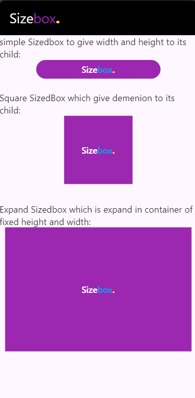

# sizebox
SizedBox is a built-in widget in flutter SDK.  It is a simple box with a specified size.

It can be used to set size constraints to the child widget, put an empty SizedBox between

the two widgets to get some space in between, or something else. It is somewhat similar to 

a Container widget with fewer properties.
## Properties of SizedBox Widget:
1. child: This property takes in a child widget as the object to display it below the SizedBox in the widget tree or inside the SizedBox n the screen.
2. height: This property specifies the height of SizedBox in pixels. It is a double value as the object.
3. width: This property also holds in a double value as the object to give width to the SizedBox.

## Types:
1. square
2. expand
3. shrink (its maintain deminsion with min & max width and height).
